private but can be inherited are protected

abstract mean khayaal

ye object create nhi kartie 
ye dusri class o nheit kartie

ye clas hotie blurprint jo ki dusri ko inherit kartie

shape ek idea hai ki saari shape me draw hona chaiye

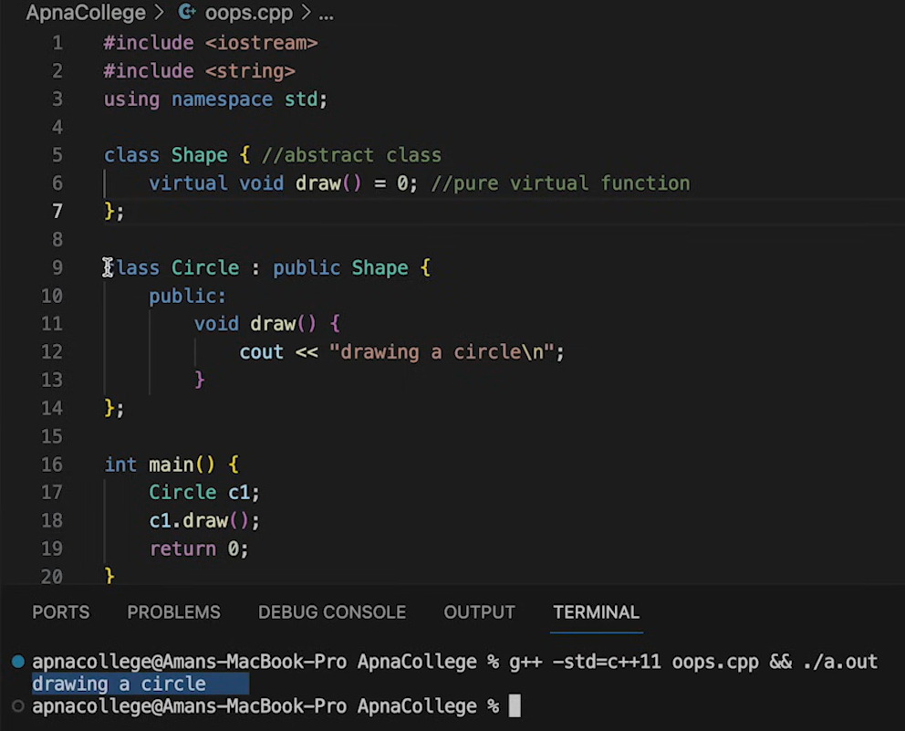

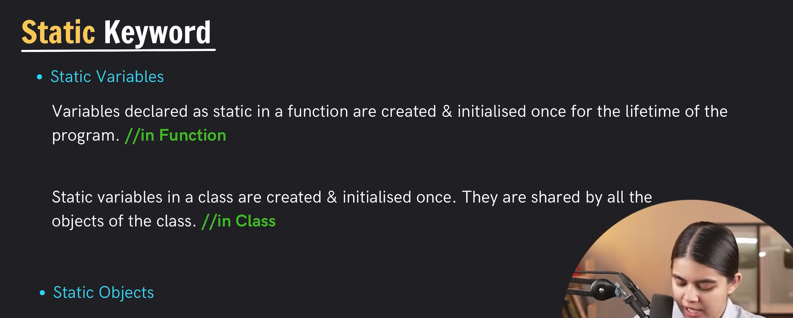

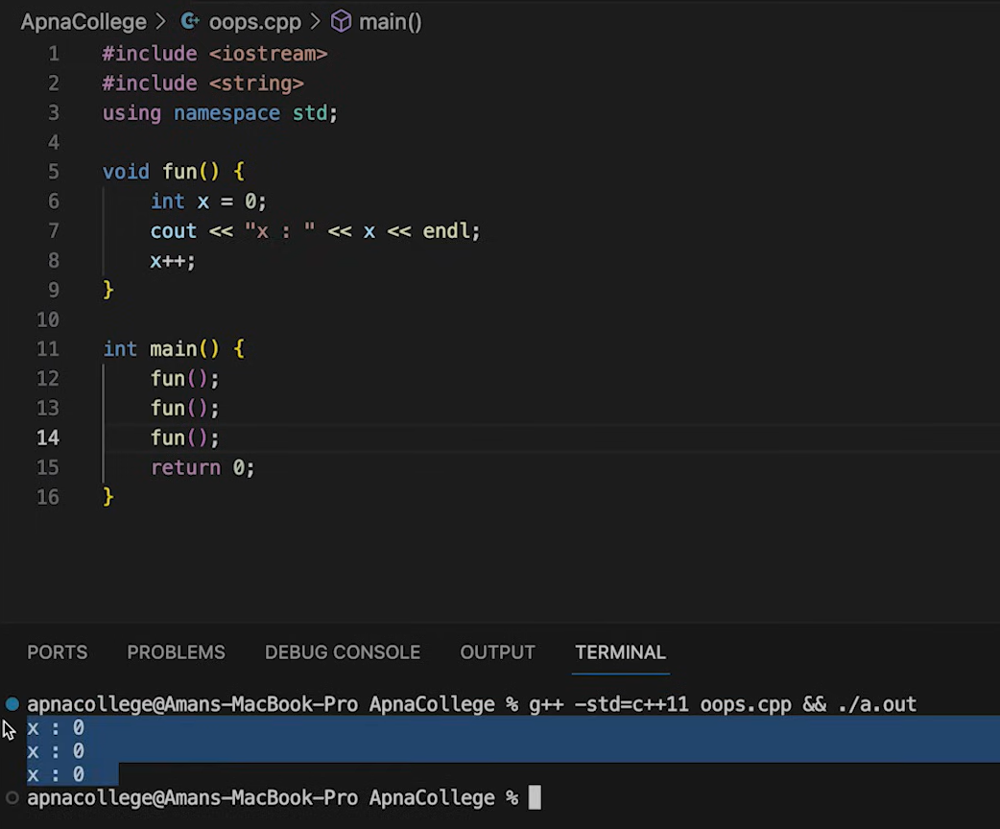

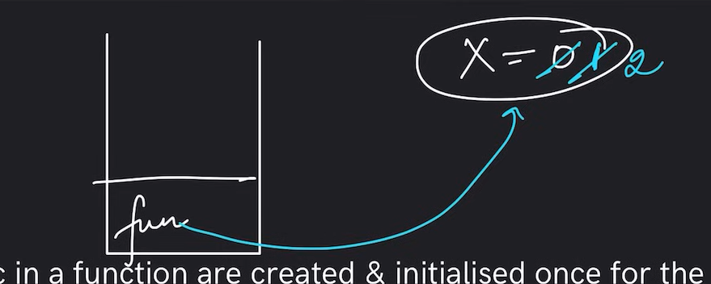

ab stack nhi memory create hoga

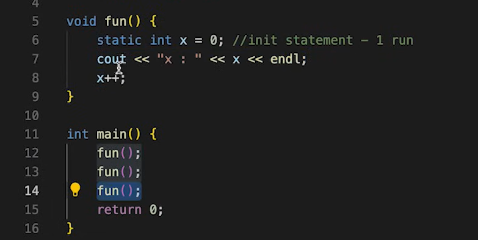

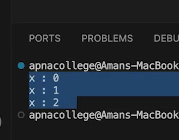

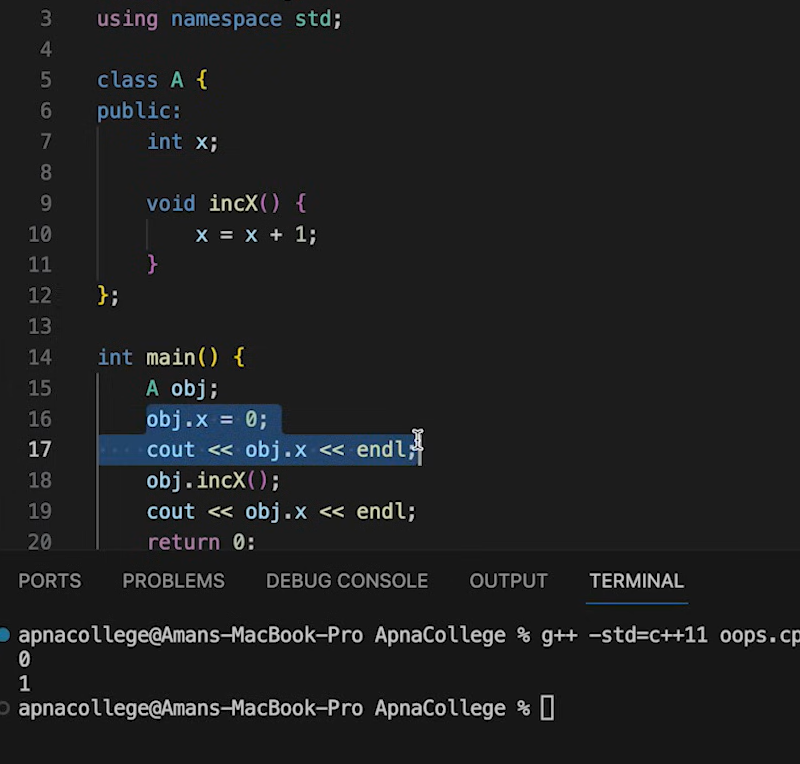

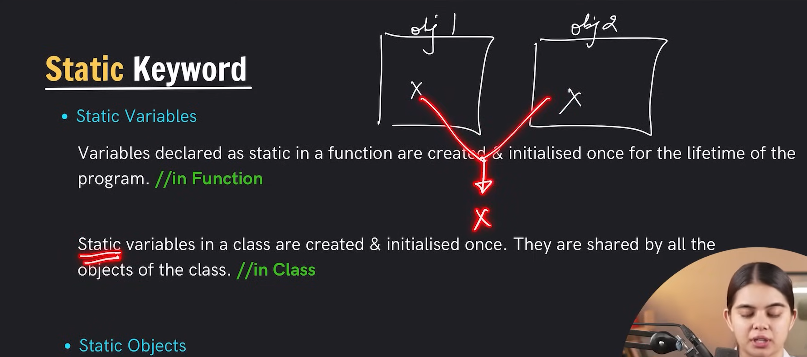

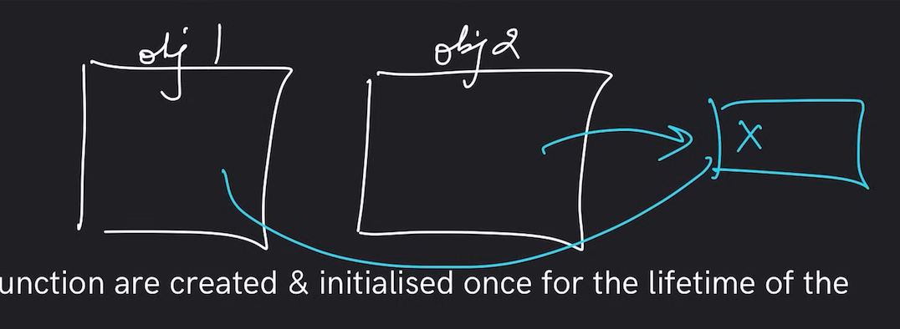

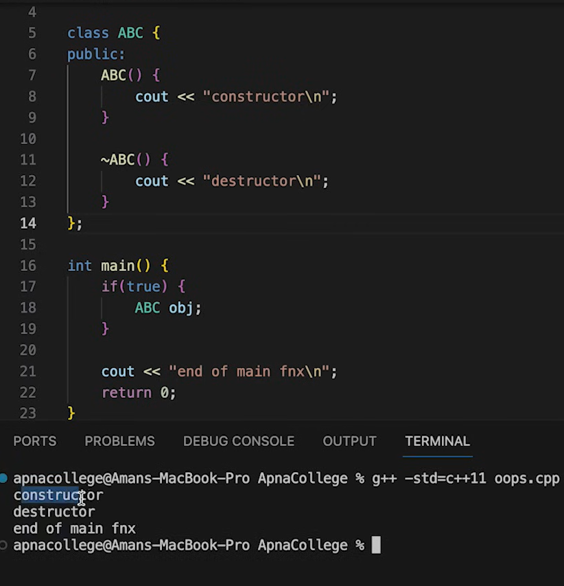

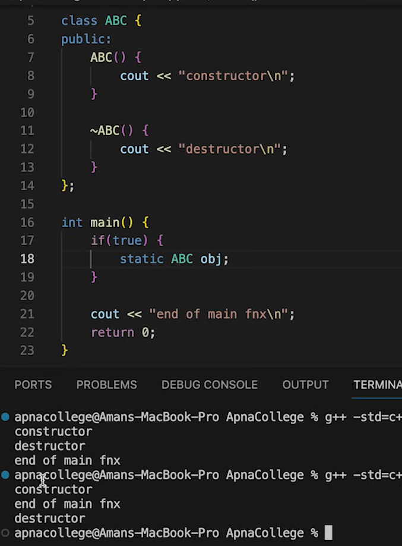

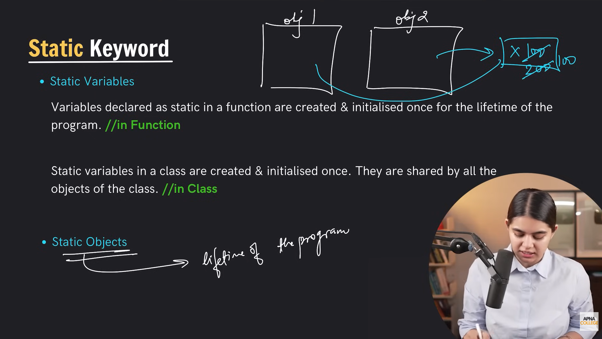